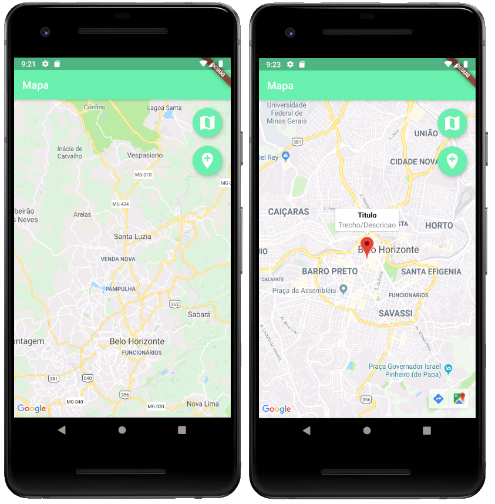
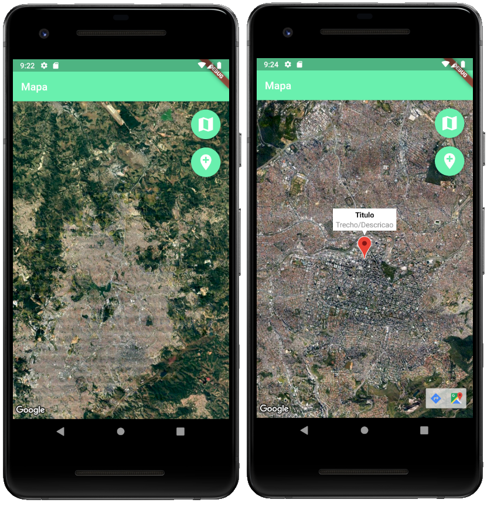

# Mapa

- Utilização da API do Google Maps e marcadores

Para obter sua API Key e adicioná-la no projeto:

- [Android](https://developers.google.com/maps/documentation/android-sdk/get-api-key)

- [IOS](https://developers.google.com/maps/documentation/ios-sdk/get-api-key)

1 - Mapa tipo "normal"

  

2 - Mapa tipo satélite

  

